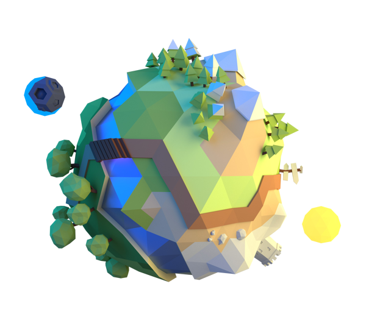

<a name="readme-top"></a>

[![Contributors][contributors-shield]][contributors-url]
[![Forks][forks-shield]][forks-url]
[![Stargazers][stars-shield]][stars-url]
[![Issues][issues-shield]][issues-url]


<!-- PROJECT LOGO -->
<br />
<div align="center">
  <a href="https://github.com/CommanderAstern/Bitbuild">
    
  </a>

<h3 align="center">Bitbuild</h3>

  <p align="center">
    A 3D virtual platform for people to build games, customize their characters, connect with others and much more!
    <br />
    <br />
    <a href="">Download APK</a>
    ·
    <a href="">Pitch Deck</a>
    ·
    <a href="https://github.com/CommanderAstern/Bitbuild/issues">Request Feature</a>
  </p>
</div>

<!-- TABLE OF CONTENTS -->
<details>
  <summary>Table of Contents</summary>
  <ol>
    <li>
      <a href="#about-the-project">About The Project</a>
      <ul>
        <li><a href="#built-with">Built With</a></li>
      </ul>
    </li>
    <li>
      <a href="#getting-started">Getting Started</a>
      <ul>
        <li><a href="#prerequisites">Prerequisites</a></li>
        <li><a href="#installation">Installation</a></li>
      </ul>
    </li>
    <li><a href="#roadmap">Roadmap</a></li>
    <li><a href="#contributing">Contributing</a></li>
    <li><a href="#contact">Contact</a></li>
  </ol>
</details>

<!-- ABOUT THE PROJECT -->
## About The Project

![Product Name Screen Shot][product-screenshot]

The project is a response to the lack of engaging content and complicated setup processes in many existing metaverse games. To address these issues, the game offers a seamless and user-friendly experience that allows players to explore and interact with other users in a safe and secure virtual environment. The use of Solana account abstraction streamlines the login process, enabling users to easily sign in using their Google, Twitter, or wallet accounts.

One of the game's unique features is the ability for users to build their own mini-games on top of the platform. This empowers users to express their creativity and bring their own ideas to life, making the experience more personalized and engaging. By providing a platform for developers to create and publish their own games, the project can attract a wide range of users with different interests, thus expanding the game's reach and appeal.

The game also features a virtual economy that leverages blockchain technology to create a secure and transparent marketplace for players to buy, sell, and trade virtual items. This includes NFT clothes that can be equipped to customize the appearance of their avatars, adding another layer of personalization and creativity to the game. By utilizing blockchain technology, the game ensures the authenticity and scarcity of these virtual items, providing a new and exciting way for users to engage with the virtual economy.

<p align="right">(<a href="#readme-top">back to top</a>)</p>

### Built With

* Unity
* C#
* Solana Blockchain
* Solana Unity SDK
* Node.js
* Figma

<p align="right">(<a href="#readme-top">back to top</a>)</p>

<!-- GETTING STARTED -->
## Getting Started

### Prerequisites

You need the following software to run this project:
* Unity 2020.3.0f1
* Visual Studio 2019
* 

### Installation

1. Clone the repo
   ```sh
   git clone
    ```
2. Open the project in Unity
3. Open the ParkScene scene
4. Build the project
5. Run the executable file

### Adding new accounts
1. Open the ParkScene scene
2. Open the Flow Control GameObject
3. In the Flow Control GameObject, click on the `Open Flow Control Window` Button.
3. Add a new account by clicking the "Add Account" button
4. Enter the account's private key

<p align="right">(<a href="#readme-top">back to top</a>)</p>


<!-- ROADMAP -->
## Roadmap

- [ ] Implement more multiplayer games and features
- [ ] Build a more developer friendly ecosystem
- [ ] Improving the UI and UX significantly

See the [open issues](https://github.com/CommanderAstern/Bitbuild/issues) for a full list of proposed features (and known issues).

<p align="right">(<a href="#readme-top">back to top</a>)</p>


<!-- CONTRIBUTING -->
## Contributing

Contributions are what make the open source community such an amazing place to learn, inspire, and create. Any contributions you make are **greatly appreciated**.

If you have a suggestion that would make this better, please fork the repo and create a pull request. You can also simply open an issue with the tag "enhancement".
Don't forget to give the project a star! Thanks again!

1. Fork the Project
2. Create your Feature Branch (`git checkout -b feature/AmazingFeature`)
3. Commit your Changes (`git commit -m 'Add some AmazingFeature'`)
4. Push to the Branch (`git push origin feature/AmazingFeature`)
5. Open a Pull Request

<p align="right">(<a href="#readme-top">back to top</a>)</p>


<!-- CONTACT -->
## Contact

Asim Jawahir - [@AsimJawahir](https://twitter.com/AsimJawahir) - asimjawahir123@gmail.com

Rahul Pujari - [@RahulPujari](https://twitter.com/therahulpujari) - rahulpujari2919@gmail.com

Pratik Jallan - [@PratikJallan](https://www.linkedin.com/in/pratik-jallan/) - pratikjalan11@gmail.com

Project Link: [https://github.com/CommanderAstern/Bitbuild](https://github.com/CommanderAstern/Bitbuild)

<p align="right">(<a href="#readme-top">back to top</a>)</p>


<!-- ACKNOWLEDGMENTS -->
## Acknowledgments

* [Best-Readme-Template](https://github.com/othneildrew/Best-README-Template)
<p align="right">(<a href="#readme-top">back to top</a>)</p>


<!-- MARKDOWN LINKS & IMAGES -->
<!-- https://www.markdownguide.org/basic-syntax/#reference-style-links -->
[contributors-shield]: https://img.shields.io/github/contributors/CommanderAstern/Bitbuild.svg?style=for-the-badge
[contributors-url]: https://github.com/CommanderAstern/Bitbuild/graphs/contributors
[forks-shield]: https://img.shields.io/github/forks/CommanderAstern/Bitbuild.svg?style=for-the-badge
[forks-url]: https://github.com/CommanderAstern/Bitbuild/network/members
[stars-shield]: https://img.shields.io/github/stars/CommanderAstern/Bitbuild.svg?style=for-the-badge
[stars-url]: https://github.com/CommanderAstern/Bitbuild/stargazers
[issues-shield]: https://img.shields.io/github/issues/CommanderAstern/Bitbuild.svg?style=for-the-badge
[issues-url]: https://github.com/CommanderAstern/Bitbuild/issues
[license-shield]: https://img.shields.io/github/license/CommanderAstern/Bitbuild.svg?style=for-the-badge
[license-url]: https://github.com/CommanderAstern/Bitbuild/blob/master/LICENSE.txt
[linkedin-shield]: https://img.shields.io/badge/-LinkedIn-black.svg?style=for-the-badge&logo=linkedin&colorB=555
[linkedin-url]: https://linkedin.com/in/asimjawahir
[product-screenshot]: ./images/Bitbuild.png
[Next.js]: https://img.shields.io/badge/next.js-000000?style=for-the-badge&logo=nextdotjs&logoColor=white
[Next-url]: https://nextjs.org/
[React.js]: https://img.shields.io/badge/React-20232A?style=for-the-badge&logo=react&logoColor=61DAFB
[React-url]: https://reactjs.org/
[Vue.js]: https://img.shields.io/badge/Vue.js-35495E?style=for-the-badge&logo=vuedotjs&logoColor=4FC08D
[Vue-url]: https://vuejs.org/
[Angular.io]: https://img.shields.io/badge/Angular-DD0031?style=for-the-badge&logo=angular&logoColor=white
[Angular-url]: https://angular.io/
[Svelte.dev]: https://img.shields.io/badge/Svelte-4A4A55?style=for-the-badge&logo=svelte&logoColor=FF3E00
[Svelte-url]: https://svelte.dev/
[Laravel.com]: https://img.shields.io/badge/Laravel-FF2D20?style=for-the-badge&logo=laravel&logoColor=white
[Laravel-url]: https://laravel.com
[Bootstrap.com]: https://img.shields.io/badge/Bootstrap-563D7C?style=for-the-badge&logo=bootstrap&logoColor=white
[Bootstrap-url]: https://getbootstrap.com
[JQuery.com]: https://img.shields.io/badge/jQuery-0769AD?style=for-the-badge&logo=jquery&logoColor=white
[JQuery-url]: https://jquery.com 
